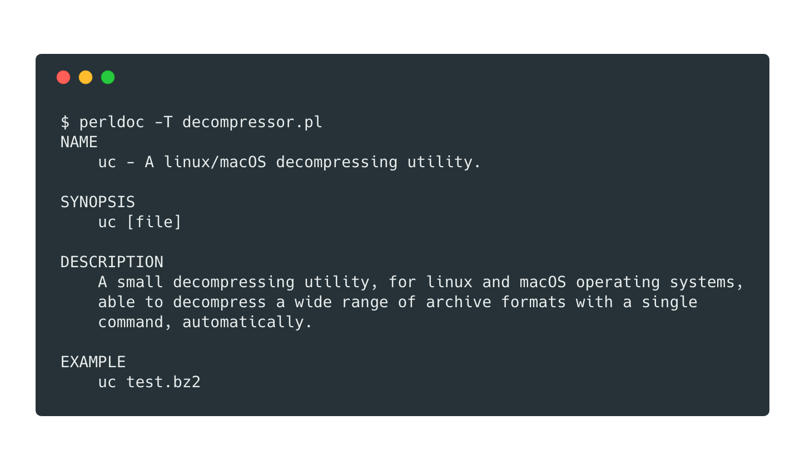

# Decompressor 

**Decompressor** is a _perl_ script and unix utility that automates the process of decompressing data by invoking the appropriate command. For the time it can automatically decompress the following archive formats:

| z | Z |
| xz | gz |
| 7z | rz |
| bz2 | arj |
| zip | pkg |
| tar | rar |
| xar | deb |

The script has been successfully tested on _linux_ and _macOS_ operating systems.

### Installation:

The best way to use this script is to create an _alias_ command. `setup.sh` script  automatically installs the perl-dependencies and creates an alias command `uc` (_or what other name you prefer_):

To install the perl-requirements manually:

`cpanm --installdeps .`

`cpanm` command allows easy installation of CPAN modules and is part of the [App::cpanminus](https://metacpan.org/pod/distribution/App-cpanminus/bin/cpanm) distribution. Of course it's not the only way to install the dependencies.

### Requirements

Since the script works by invoking the appropriate, based on the filetype, commands, the following programs/utilities must be installed (_most of the them are pre-installed on linux/macOS systems_):

*   7z
*   gzip
*   dpkg
*   xar
*   tar
*   unzip
*   unrar
*   arj (_linux_) / unarj (_macOS_)

## License

This project is licensed under the GPLv3 License - see the [LICENSE](LICENSE) file for details